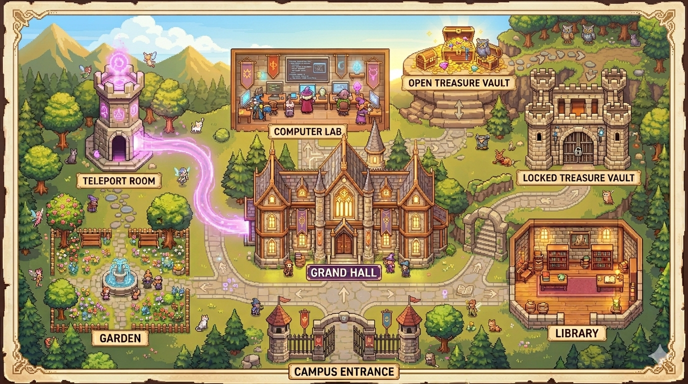
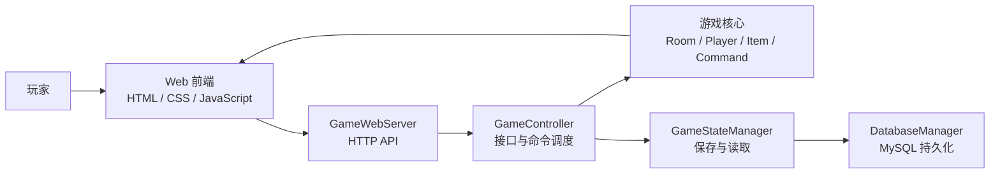

# 🎮 World of Zuul: Campus Adventure

> 一款基于 **Java + Web** 的校园探索解谜游戏。项目从经典 *World of Zuul* 文本冒险出发，扩展为带有角色动画、房间地图、物品交互、谜题流程、登录注册、保存读取和后端 API 的完整浏览器游戏体验。


---

## 📖 项目简介

**World of Zuul: Campus Adventure** 是一个以大学校园为舞台的 Web 冒险游戏。玩家从校园入口出发，在主大厅、图书馆、计算机实验室、森林小路、上锁宝库、传送房间等场景中探索，收集关键物品，破解线索谜题，最终获得 `final_key` 并完成逃离。

项目保留了 Zuul 原本的面向对象结构和命令式交互，同时加入了完整的 Web 可视化体验：

- 🗺️ 房间背景图与校园地图展示
- 🧍 四方向角色行走动画
- 🧭 可达方向按钮提示与键盘移动
- 🎒 背包、物品详情、重量和使用效果
- 🔐 笔记本、电脑、密码箱等谜题流程
- 💾 登录注册、保存读取、状态同步
- 🌐 Java 后端 HTTP 服务与前端 API 通信

它不是单纯的文本命令练习，而是一个拥有前端交互、后端状态、持久化支持和完整游戏目标的小型全栈游戏项目。

---

## 🖼️ 游戏预览

| 校园入口 | 图书馆 | 校园地图 |
| --- | --- | --- |
|  |  |  |

---

## ✨ 核心特色

| Feature | Description |
| --- | --- |
| 🎮 Web 可视化游戏 | 使用浏览器作为主界面，展示房间背景、角色、浮动面板和弹窗交互。 |
| 🧍 角色行走动画 | 支持上下左右四方向移动，角色会根据方向切换对应动画帧。 |
| 🧭 智能方向提示 | 方向按钮只在当前房间实际可走时启用，避免误导玩家。 |
| ⌨️ 键盘与按钮控制 | 支持方向按钮、WASD 和方向键操作。 |
| 🧩 谜题系统 | 包含笔记本、电脑、密码箱、最终钥匙等连续解谜流程。 |
| 🎒 物品与背包 | 物品具有名称、重量、描述、图标、类型和使用效果。 |
| 💾 保存 / 读取 | 支持游戏进度保存、读取和新游戏状态重置。 |
| 👤 用户会话 | 提供登录、注册和 session 级游戏状态管理。 |
| 🌐 Java Web 服务 | 通过 `GameWebServer` 和 `GameController` 为前端提供 API。 |
| 🧪 自动化测试 | 使用 Maven 编译和执行 Java 测试流程。 |

---

## 🧭 游戏世界

游戏世界由多个互相连接的房间组成，每个房间承担不同的探索和解谜职责。

| Room | Role |
| --- | --- |
| 校园入口 | 游戏起点，也是最终逃离位置 |
| 主大厅 | 校园核心枢纽，连接多个区域 |
| 图书馆 | 放置笔记本线索，推动谜题链 |
| 计算机实验室 | 电脑与数据线相关谜题区域 |
| 森林小路 | 地图、密码箱和最终出口相关区域 |
| 上锁宝库 | 需要钥匙解锁的重要房间 |
| 宝藏房间 | 后期关键奖励区域 |
| 传送房间 | 确认后随机传送到其他房间 |

玩家需要在不同房间之间移动，观察环境、拾取物品、使用道具并逐步解开校园中的隐藏谜题。

---

## 🧩 解谜流程

游戏的核心体验围绕“探索 - 收集 - 推理 - 解锁 - 通关”展开：

1. 从校园入口开始探索，熟悉房间连接关系。
2. 收集钥匙、地图、笔记本、数据线等关键物品。
3. 使用钥匙进入上锁宝库。
4. 通过笔记本和电脑获得谜题线索。
5. 输入正确密码打开箱子，获得 `final_key`。
6. 回到最终出口，使用最终钥匙完成游戏。

---

## 🏗️ 系统架构



项目整体采用清晰的分层结构：

- **Web 前端**：负责场景渲染、角色动画、按钮控制、弹窗和玩家反馈。
- **HTTP 服务层**：负责接收浏览器请求并返回 JSON 数据。
- **控制器层**：负责解释命令、调用游戏逻辑、组织响应数据。
- **游戏核心层**：负责房间、出口、玩家、物品、命令和通关状态。
- **状态管理层**：负责保存、读取和同步游戏进度。
- **持久化层**：为用户和游戏状态提供数据库支持能力。

---

## 📁 项目结构

```text
.
├── src/
│   ├── main/java/cn/edu/whut/sept/zuul/
│   │   ├── WebMain.java              # Web 启动入口
│   │   ├── GameWebServer.java        # 轻量级 HTTP 服务
│   │   ├── GameController.java       # API 与游戏控制器
│   │   ├── Game.java                 # 游戏世界初始化
│   │   ├── Room.java                 # 房间模型
│   │   ├── Player.java               # 玩家状态与背包
│   │   ├── Item.java                 # 物品模型
│   │   ├── GameStateManager.java     # 保存 / 读取管理
│   │   └── *Command.java             # 命令实现
│   └── test/java/cn/edu/whut/sept/zuul/
│       └── *Test.java                # 测试类
├── web/
│   ├── index.html                    # 页面结构
│   ├── game.js                       # 前端游戏逻辑
│   ├── style.css                     # 页面样式
│   └── assets/                       # 房间、角色、物品、谜题图片
├── lib/
│   └── mysql-connector-j-9.5.0.jar   # MySQL JDBC 驱动
├── pom.xml                           # Maven 配置
└── GAMEPLAY.md                       # 玩法说明与测试清单
```

---

## 🚀 快速开始

### 环境要求

- Java 8 或更高版本
- Maven
- 现代浏览器
- 可选：MySQL 数据库

### 运行测试

```powershell
mvn test
```

### 启动 Web 游戏

```powershell
java -cp "target\classes;lib\mysql-connector-j-9.5.0.jar" cn.edu.whut.sept.zuul.WebMain
```

浏览器访问：

```text
http://localhost:8080
```

如果 `8080` 端口被占用，程序会自动切换到可用端口，并在终端输出实际访问地址。

---

## 🎛️ 常用命令

虽然游戏已经提供可视化按钮和弹窗交互，命令面板仍然保留了经典 Zuul 风格。

| Command | Description |
| --- | --- |
| `go north/south/east/west` | 向指定方向移动 |
| `look` | 查看当前房间 |
| `take <item>` | 拾取物品 |
| `drop <item>` | 丢弃物品 |
| `use <item>` | 使用物品 |
| `items` | 查看房间物品和背包 |
| `status` | 查看游戏进度 |
| `save` | 保存游戏 |
| `load` | 读取存档 |
| `teleport` | 在传送房间触发随机传送 |

---

## 🧪 测试建议

```powershell
node --check web/game.js
mvn test
```

`node --check` 用于检查前端脚本语法，`mvn test` 用于编译 Java 项目并执行测试流程。

---

## 🧱 技术栈

| Layer | Technology |
| --- | --- |
| Language | Java |
| Build | Maven |
| Frontend | HTML, CSS, JavaScript |
| Backend | Java HTTP Server |
| Persistence | MySQL / JDBC |
| Assets | Room Backgrounds, Character Sprites, Item Icons, Puzzle Images |

---

## 🌟 项目亮点

- 将经典 Zuul 文本冒险升级为可视化校园探索游戏，具备完整 Web 游戏体验。
- 支持键盘与按钮双操作，角色会根据方向逐帧行走，移动反馈更自然。
- 多个精美房间背景随探索切换，营造清晰的校园地图与闯关氛围。
- 融合物品收集、房间解锁、密码推理和最终逃离目标，形成连续解谜流程。
- 房间内物品以悬浮气泡直接显示，玩家可点击图标拾取，探索反馈更直观。
- 提供三槽本地存档、读取与进度摘要，方便玩家保留不同游戏进度。
- 弹窗、方向高亮、无效路径禁用和状态提示让交互更友好、更直观。

---

## 📌 Project Identity

**World of Zuul: Campus Adventure** 展示了一个经典教学项目如何逐步成长为可运行、可交互、可保存、可展示的完整游戏系统。它结合了面向对象设计、Web 前端体验、后端 API、状态管理和自动化测试，是一个具有完整工程结构的小型全栈 Java 游戏项目。
